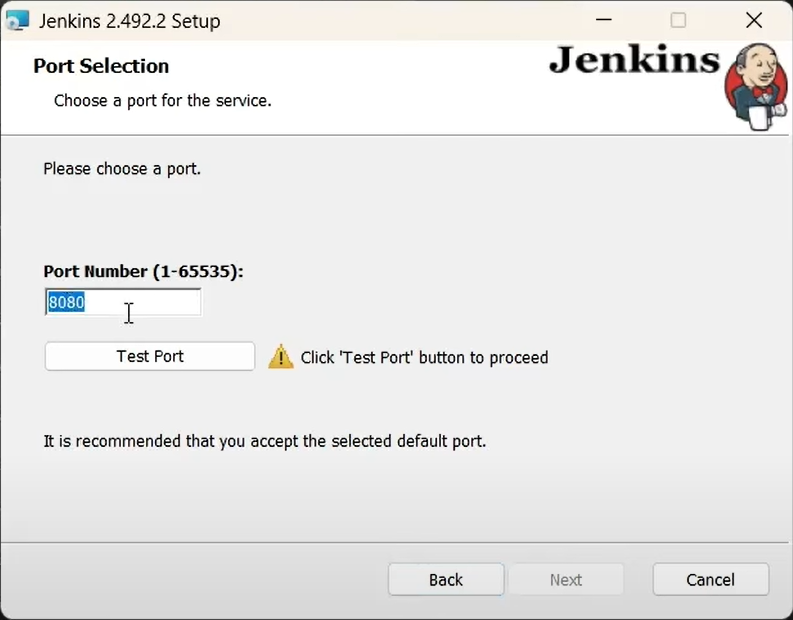

# Complete Jenkins Setup Guide for Windows

This guide provides step-by-step instructions to install and set up Jenkins on Windows.

## 1. Download Jenkins

- Go to the official Jenkins download page: [https://www.jenkins.io/download/](https://www.jenkins.io/download/)
- In the **Windows** section, download the **LTS** (Long-Term Support) release installer.

## 2. Install Jenkins

- Run the downloaded installer and follow the prompts.

- When asked, specify the path to your JDK 17 or 21 installation (Jenkins requires one of these versions).

- Choose **Run service as LocalSystem**.

- Set the port for Jenkins (default is 8080).

## 3. Initial Jenkins Setup

- After installation, open your browser and go to [http://localhost:8080](http://localhost:8080).

- On the Jenkins welcome page, you will be prompted to unlock Jenkins.
- Locate the initial admin password in the file specified on the screen (usually at `C:\Program Files\Jenkins\secrets\initialAdminPassword`).
- Copy and paste this password into the input box to proceed.

## 4. Install Plugins

- Follow the prompts to install recommended plugins.

## 5. Create Admin User

- Set up your first admin user.

- Sign in with your new admin credentials.

## 6. Jenkins Home Page

- You will be redirected to the Jenkins home page.

## 7. Create a Demo Job

- Create a new job to test your Jenkins setup.

---

You have now completed the Jenkins installation and initial setup on Windows.