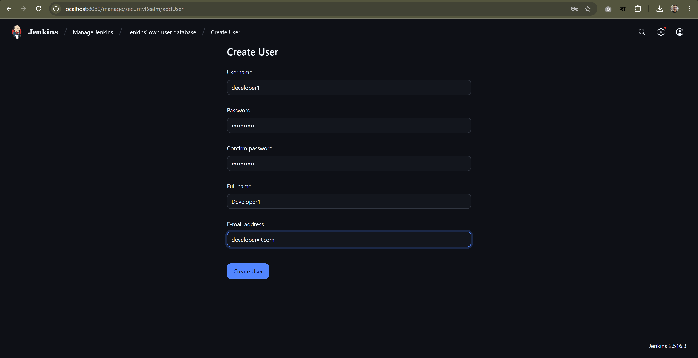
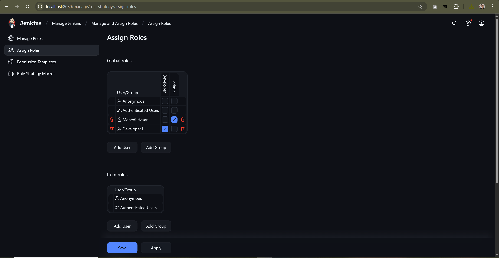

# Assigning Roles to a User in Jenkins

This guide walks you through assigning roles to users in Jenkins using the Role-Based Authorization Strategy plugin.

---

## 1. Install the Role-Based Authorization Strategy Plugin

Go to **Manage Jenkins** → **Manage Plugins** and install the **Role-Based Authorization Strategy** plugin.

---

## 2. Configure Security Settings

Navigate to **Manage Jenkins** → **Configure Global Security**.  
Set **Authorization** to **Role-Based Strategy**.

---

## 3. Create a Global Role

Go to **Manage Jenkins** → **Manage and Assign Roles** → **Manage Roles**.  
Create a global role named `Developer` and assign the desired permissions.

---

## 4. Create a User

Navigate to **Manage Jenkins** → **Manage Users** → **Create User**.  
Create a user named `developer1` with appropriate credentials.

---

## 5. Assign Role to User

Go to **Manage Jenkins** → **Manage and Assign Roles** → **Assign Roles**.  
Assign the `Developer` role to the user `developer1`.

---

## 6. Verify User Permissions

Log in as `developer1`.  
You will notice that the user has limited access based on the assigned role.

---

**Note:**  
Assigning roles helps enforce security and restricts users to only the permissions they need.