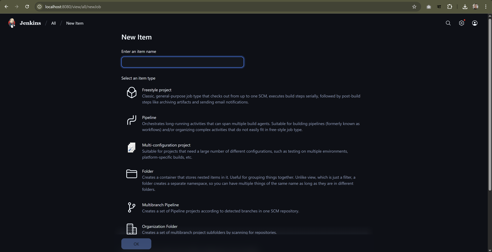
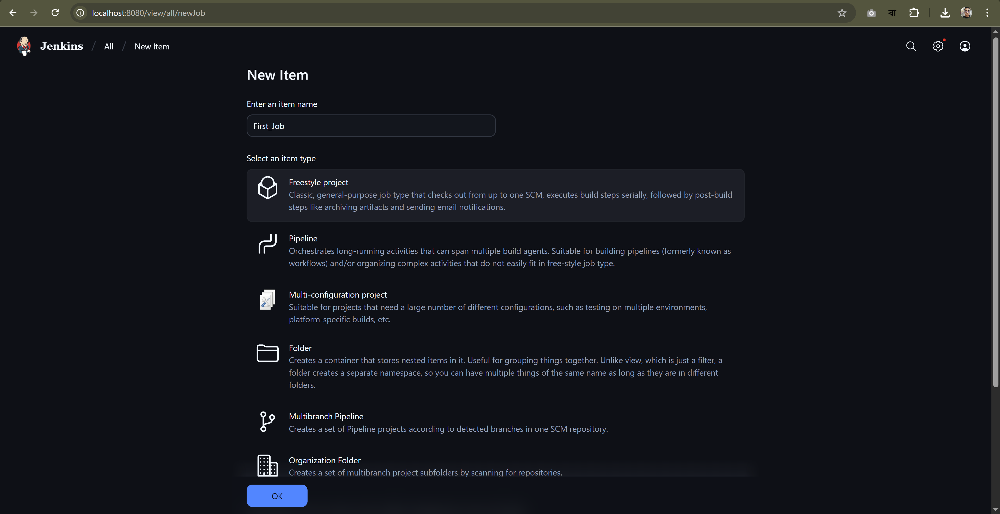
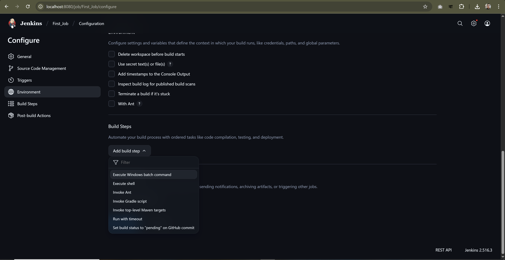
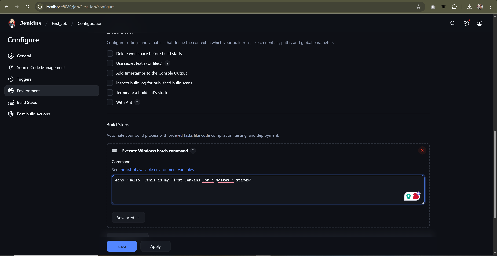
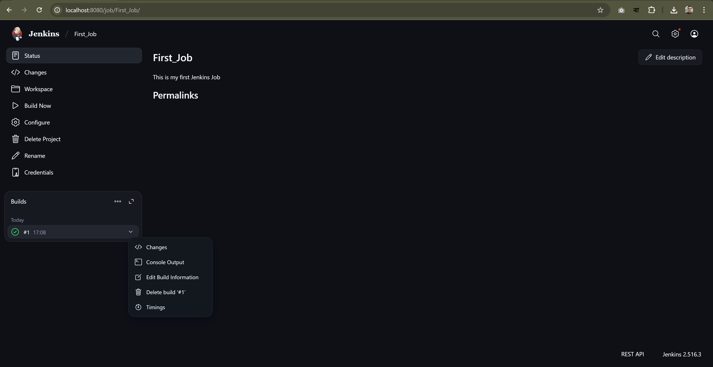
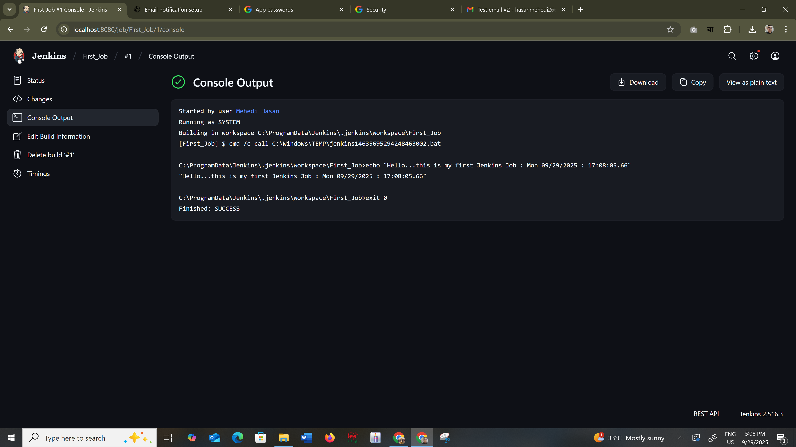
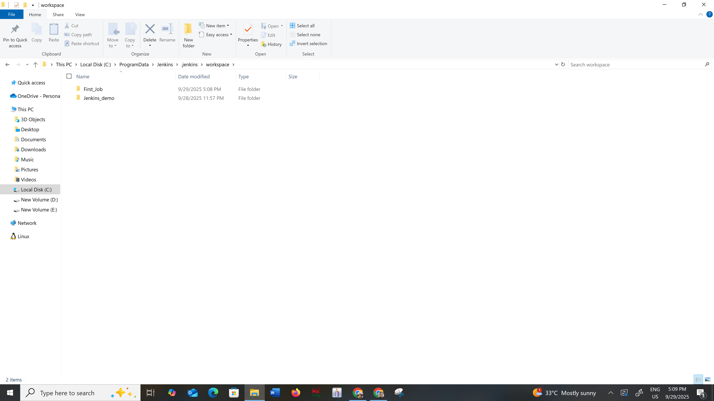

# Creating a Job in Jenkins

This guide walks you through creating a new job in Jenkins.

---

## 1. Create a New Item

Click on **"New Item"** in the Jenkins dashboard.

---

## 2. Choose Freestyle Project

Select **"Freestyle project"** as the job type and provide a name.

---

## 3. Configure Build Step

Scroll to the **"Build"** section and choose **"Add build step" > "Execute Windows batch command"**.

---

## 4. Enter Build Commands

Enter the desired Windows batch commands for your build.

---

## 5. Build the Job

Click **"Save"** and then **"Build Now"** to run the job.

---

## 6. Check Console Output

Click on the build number and select **"Console Output"** to view logs.

---

## 7. Workspace Folder

Jenkins creates a workspace folder for the job where files are stored.

---
