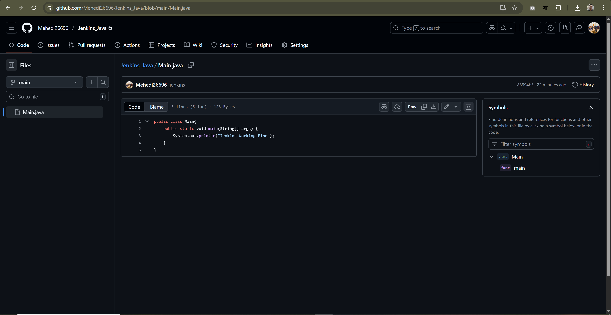

# GitHub Connection with Jenkins

## 1. Create a Fine-Grained PAT Token

Set the required permissions and grant repository access.

Copy and save the generated PAT token.

---

## 2. Add Credentials in Jenkins

Navigate to Jenkins and add a new credential using the PAT token.

---

## 3. Configure GitHub Repository in Jenkins

Copy the repository HTTPS URL.

---

## 4. Create a New Freestyle Job

Set up a new Freestyle project in Jenkins.

---

## 5. Configure Source Code Management and Build Steps

Set up credentials in the Source Code Management section and configure the build command.

---

## 6. Build the Job

Trigger the build.

---

## 7. Check Console Output

Review the console output for build logs and results.

